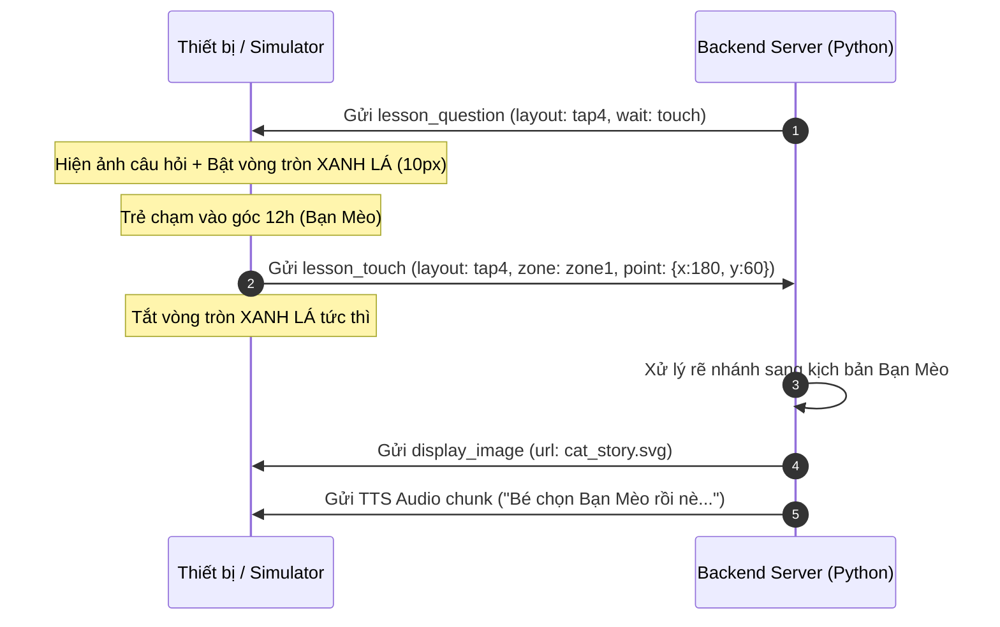

# 📡 Đặc tả Giao thức WebSocket & Cảm ứng V2 (Bống AI)

Tài liệu này định nghĩa chuẩn định dạng gói tin trao đổi qua WebSocket giữa **Thiết bị / Web Simulator (Client)** và **Máy chủ (Backend Server)** cho tính năng tương tác màn hình tròn 360×360px và nhận diện cảm ứng 7 Layouts.

---

## 1. Hệ toạ độ & Quy ước Hình học Màn hình tròn

* **Kích thước hiển thị:** $360 \times 360\text{px}$.
* **Tâm màn hình:** $(x_0, y_0) = (180, 180)$.
* **Bán kính ngoài:** $R = 180\text{px}$.
* **Góc $0^\circ$:** Luôn ở **đỉnh 12 giờ**, góc tăng theo **chiều kim đồng hồ**.
* **Vùng chết tâm (Dead Zone - `cham_khac`):**
  * `tap3`, `tap4`: Bán kính tâm $r \le 45\text{px}$ ($25\% R$).
  * `tap5`, `tap6`: Bán kính tâm $r \le 63\text{px}$ ($35\% R$).
* **Nhận diện Vuốt (Swipe):**
  * Quãng đường vuốt $\Delta \ge 60\text{px}$.
  * Thời gian vuốt $\le 800\text{ms}$.
  * Tỉ lệ trục trội $\ge 1.5\times$ (chống vuốt chéo).

---

## 2. Bảng phân loại 7 Layouts & Tên Zone chuẩn

| Tên Layout (`layout`) | Số vùng | Danh sách Zone trả về (`zone`) | Quy ước góc / Vùng |
|---|:---:|---|---|
| **`tap2_tren_duoi`** | 2 | `zone1` (Trên), `zone2` (Dưới) | Nửa trên: $y \le 180$, Nửa dưới: $y > 180$. Không có vùng chết. |
| **`tap2_trai_phai`** | 2 | `zone1` (Trái), `zone2` (Phải) | Nửa trái: $x \le 180$, Nửa phải: $x > 180$. Không có vùng chết. |
| **`tap3`** | 3 | `zone1`, `zone2`, `zone3`, `cham_khac` | 3 rẻ quạt $120^\circ$. Zone 1 **bắt đầu** từ đỉnh ($0^\circ \to 120^\circ$). Vùng chết $r \le 45\text{px}$. |
| **`tap4`** | 4 | `zone1`, `zone2`, `zone3`, `zone4`, `cham_khac` | 4 góc phần tư $90^\circ$. Zone 1 **bắt đầu** từ đỉnh ($0^\circ \to 90^\circ$), tức góc phần tư trên–phải. Vùng chết $r \le 45\text{px}$. |
| **`tap5`** | 5 | `zone1` .. `zone5`, `cham_khac` | 5 rẻ quạt $72^\circ$. Zone 1 **bắt đầu** từ đỉnh ($0^\circ \to 72^\circ$). Vùng chết $r \le 63\text{px}$. |
| **`tap6`** | 6 | `zone1` .. `zone6`, `cham_khac` | 6 rẻ quạt $60^\circ$. Zone 1 **bắt đầu** từ đỉnh ($0^\circ \to 60^\circ$). Vùng chết $r \le 63\text{px}$. |
| **`swipe`** | 4 | `vuot_len`, `vuot_xuong`, `vuot_trai`, `vuot_phai`, `cham_khac` | Vuốt dứt khoát 4 hướng. Chạm đơn thuần hoặc vuốt $<60\text{px} \to$ `cham_khac`. |

> **Quy ước đánh số vùng quạt.** Zone 1 **bắt đầu** ở mốc 12 giờ (không phải nằm giữa mốc đó), các vùng sau đánh số **theo chiều kim đồng hồ**. Nghĩa là có một đường biên nằm đúng trên đỉnh 12 giờ, và hình minh hoạ phải được vẽ theo đúng quy ước này.
>
> **Điểm nằm trên đường biên.** Mọi layout đều lấy biên **thuộc về vùng có số nhỏ hơn**: tại đúng $y = 180$ thì `tap2_tren_duoi` trả `zone1`, tại đúng $x = 180$ thì `tap2_trai_phai` trả `zone1`, và tại đúng $0^\circ$ (đỉnh 12 giờ) thì các layout quạt trả `zone1`. Chỉ lệch một hàng pixel, nhưng cần chốt để hai bên không chấm khác nhau ở đó.
>
> **Ngoài vòng kính.** Tấm cảm ứng là hình vuông còn kính là hình tròn, nên ngón tay có thể chạm vào bốn góc không tồn tại. Mọi điểm có $r > 180\text{px}$ đều trả `cham_khac`, kể cả khi nó là điểm bắt đầu của một cú vuốt.

---

## 3. Định dạng Gói tin (Wire Protocol)

### 3.1. Client $\to$ Server: Sự kiện Chạm/Vuốt (`lesson_touch`)

Khi trẻ chạm hoặc vuốt trên màn hình trong cửa sổ câu hỏi, Client gửi gói tin JSON qua WebSocket:

```json
{
  "type": "lesson_touch",
  "session_id": "1651446a-d89e-46ff-b61b-c4472736ce0b",
  "layout": "tap4",
  "zone": "zone1",
  "point": {
    "x": 180,
    "y": 65
  },
  "duration_ms": 115
}
```

#### Chi tiết các trường:
* `type` *(string, bắt buộc)*: Luôn là `"lesson_touch"`.
* `session_id` *(string, tuỳ chọn)*: ID phiên hội thoại hiện tại.
* `layout` *(string, bắt buộc)*: 1 trong 7 layout: `"tap2_tren_duoi" | "tap2_trai_phai" | "tap3" | "tap4" | "tap5" | "tap6" | "swipe"`.
* `zone` *(string, bắt buộc)*: Kết quả phân loại hình học (ví dụ: `"zone1"`, `"zone2"`, `"vuot_len"`, `"cham_khac"`), hoặc `"silent"` — xem bên dưới.
* `point` *(object, tuỳ chọn)*: Toạ độ $(x, y)$ tại thời điểm **nhấn tay** (0..360px). Là điểm trẻ nhắm tới, trước khi ngón tay có thể trượt đi.
* `duration_ms` *(number, tuỳ chọn)*: Thời gian chạm giữ / vuốt (milliseconds).

#### Hết thời gian chờ (`zone: "silent"`)

Khi cửa sổ câu hỏi đóng lại mà trẻ không chạm gì (hết `timeout_ms` ở §3.2), Client gửi cùng frame `lesson_touch` với `zone: "silent"` và không kèm `point` / `duration_ms`. Nếu thiếu gói tin này thì trẻ chỉ cần ngồi im là cả thiết bị lẫn máy chủ đều đợi lẫn nhau vô hạn. `silent` là đúng tên nhánh mà lược đồ bài học đã dùng cho trường hợp này, nên backend có thể rẽ nhánh y như với câu hỏi bằng giọng nói.

```json
{ "type": "lesson_touch", "session_id": "…", "layout": "tap4", "zone": "silent" }
```

---

### 3.2. Server $\to$ Client: Mở Câu hỏi Chạm (`lesson_question`)

Khi bài học đến node câu hỏi chạm, Server gửi gói tin yêu cầu Client mở cửa sổ tương tác và bật Vòng Xanh lá:

```json
{
  "type": "lesson_question",
  "question_type": "touch",
  "touch_layout": "tap4",
  "image_url": "https://cdn.example.com/assets/animals_quiz.svg",
  "timeout_ms": 10000
}
```

#### Chi tiết các trường:
* `type` *(string)*: `"lesson_question"`.
* `question_type` *(string)*: `"touch"` (chờ chạm/vuốt) hoặc `"speech"` (mở mic chờ nói).
* `touch_layout` *(string)*: 1 trong 7 layout cảm ứng.
* `image_url` *(string, tuỳ chọn)*: URL ảnh minh họa các lựa chọn.
* `timeout_ms` *(number, tuỳ chọn)*: Thời gian chờ trẻ phản hồi (mặc định 10.000ms). Hết hạn thì Client gửi `zone: "silent"` (§3.1).

> `touch_layout` không thuộc 7 layout hợp lệ thì Client **không mở cửa sổ nào** và báo lỗi lên màn hình, thay vì chấm trẻ theo một lưới mà hình minh hoạ không hề vẽ theo. Với `question_type: "speech"` thì Client mở mic và bật vòng **Đỏ**.

---

### 3.3. Server $\to$ Client: Chuyển cảnh Ảnh Minh họa (`display_image`)

Server có thể chủ động chuyển ảnh khi trẻ rẽ nhánh hoặc chuyển bước bài học:

```json
{
  "type": "display_image",
  "url": "https://cdn.example.com/assets/happy_cat.svg"
}
```

---

## 4. Luồng Xử lý (Sequence Flow)



---

## 5. Hướng dẫn Tích hợp cho Backend Team (Python / FastAPI)

Backend chỉ cần thêm handler đơn giản cho frame `lesson_touch`:

```python
async def handle_lesson_touch(websocket, payload: dict):
    layout = payload.get("layout")
    zone = payload.get("zone")
    session_id = payload.get("session_id")
    
    # 1. Bỏ qua nếu không đúng câu hỏi hiện tại
    if not current_question or current_question.layout != layout:
        return
    
    # 2. Xử lý rẽ nhánh theo Zone
    next_node = current_question.branches.get(zone)
    if next_node:
        await play_node(websocket, next_node)
    elif zone == "cham_khac":
        await play_guidance(websocket, "Bé hãy bấm vào 1 trong các hình nhé!")
```
